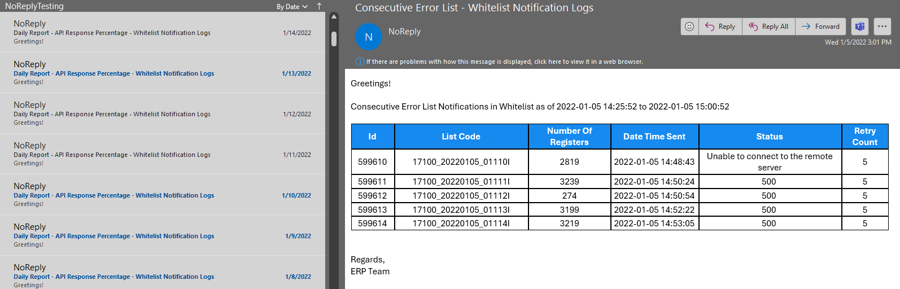
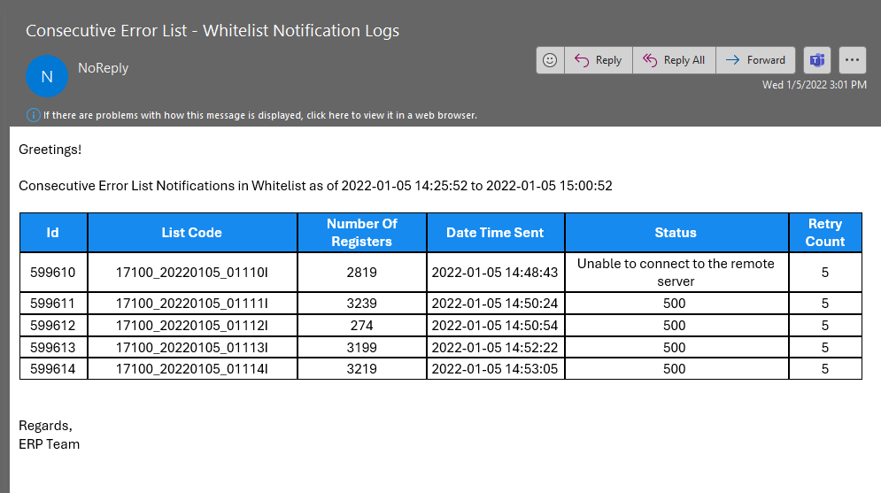

# CompanyProject_API_Status_Notification
Company Project for monitoring API status notification thru email

## API Status Logs Analysis
### Company Project, MPTC Philippines – January 2022

  •	Developed a SQL query to detect at least 3 consecutive API errors within 1,000+ logs over 30-minute intervals.
  
  •	Created a SQL query calculating the count and percentage of API statuses from 25,000+ log entries, on an hourly and daily basis for monitoring purposes.
  
  •	Built an application to automatically email the results to the team, helping to anticipate and prevent issues, mitigating 30% impact on business operations.

## Sample Emails
  -  Daily Status Report

     

  -  Consecutive Error List

      
      
      
